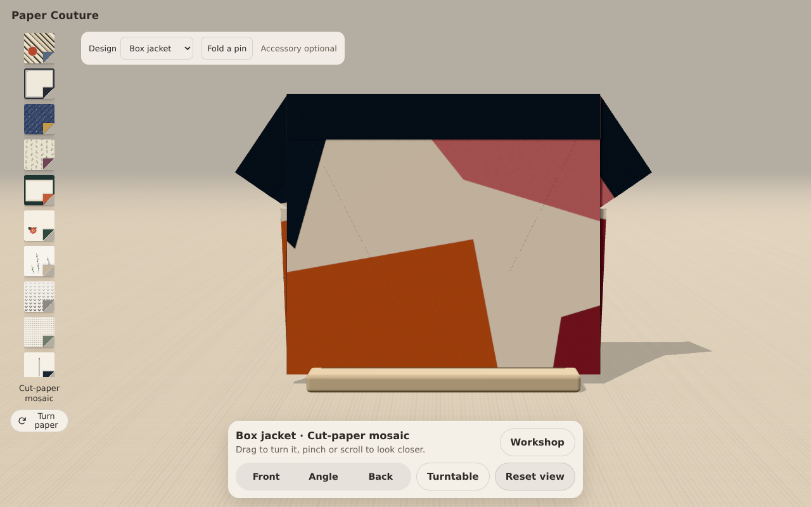
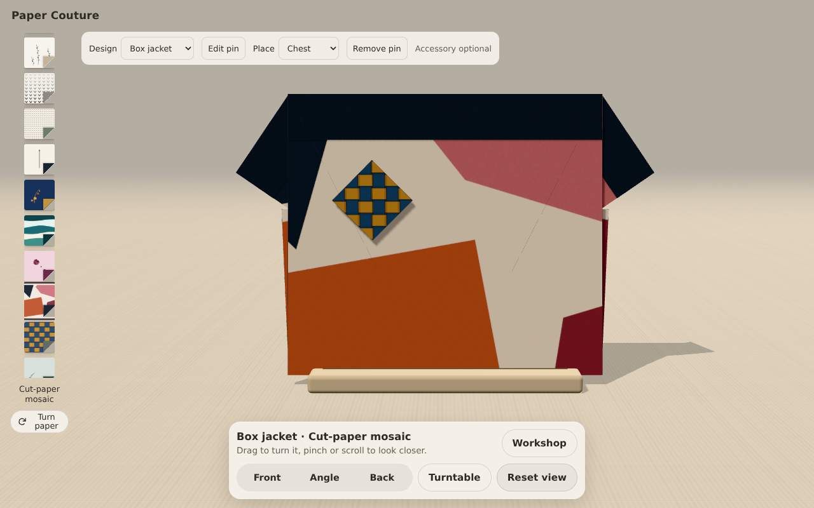
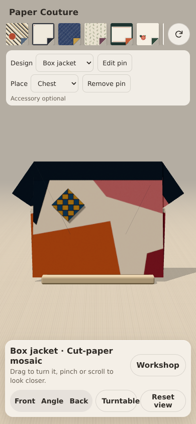

# Box jacket and diamond pin prototype

Based on the played Paper Couture snapshot at 43774efb743c6f4129ec7b31840f38a032424da7.
Charlie reviewed the original garment and requested a jacket and optional accessory.

## Try it

Choose Box jacket from Design. Changing garment starts a fresh square and keeps
its selected paper and quarter-turn. Fold six steps, including opening the sleeves
and folding the entire lower panel onto the back. Display uses the same inspection
controls. The A-line remains available and its authored sequence is unchanged.

After finishing either garment, choose Fold a pin. The garment is held while a
separate square appears. Choose any paper and turn it independently; then turn the
square over and fold its four corners to the centre. Attach pin returns to the
finished garment. Choose neckline, chest or waist, or Remove pin. Edit pin restores
its own paper, orientation and last completed fold. Returning from an unfinished
pin leaves it unattached. New garments keep the completed pin available; it stays
hidden until the garment is finished. Reload resets the session as before.

This first accessory is a diamond pin, not a bow. It tests folding a separate sheet
and pairing its paper with the garment. Attachment is a styling placement, not a
simulated fastening or proof that two sheets mechanically lock together.

## Construction and scope

The jacket is related to the original dress construction, with different proportions,
sleeve creases and a deep back hem. Its resting extent is 1.676 × 1.140 model units,
compared with the dress's 1.707 × 1.800. No area is cut away and no mesh is stretched.
It is a closed-front silhouette study, not a lapelled or opening jacket.

The pin uses four corner folds after turning the print down. Its visible seam lines
follow actual facet edges. Some papers put almost no motif in those corner regions;
Woven checks and Tidal bands make the folding more visible than sparse papers do.
All sixteen papers, two-sided registration and the fold engine are unchanged.

A display-camera adjustment preserves orbit and relative zoom when available
viewport space changes. This prevents a desktop framing from cropping the wider
jacket after the window becomes phone-shaped.

## Verification

Node 24: typecheck, tests and production build pass. The existing geometry and
controller checks now run for all three constructions: area, rigidity, seam
continuity, sampled animation endpoints, table clearance and controller reversal.
The rotation diagnostic still passes. No thresholds were relaxed. Largest sampled
jacket hinge separation: 0.033 model units (render layer offsets; existing limit
0.044). These checks do not establish continuous collision-free physical folding.

Production output under cmish.dev's CSP was exercised in headless Chromium:
- Six jacket steps forward, display, and back preset.
- Five pin steps, independent paper/turn, attach and chest placement.
- Remove, design change, reset, re-edit and return from an unfinished pin.
- Desktop 1280×800, portrait 390×844 and landscape 844×390 captures.
- No page/console errors or horizontal document overflow in the checked views.

No physical paper, physical phone or Safari test. Nothing is saved across reloads.

