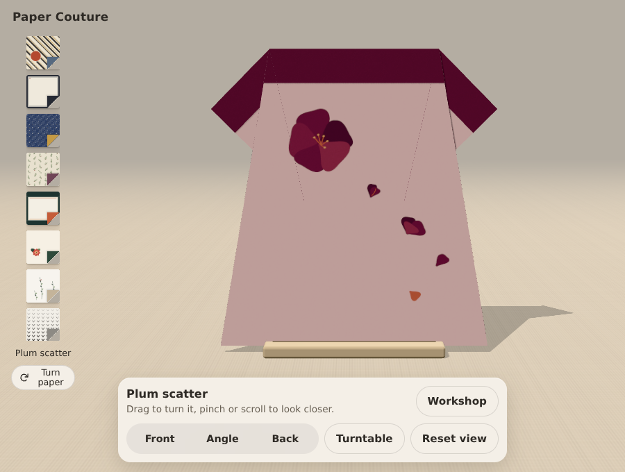

# Plum drawing refinement — 2026-09-28

Based on paper-studies-02 at 7a9898b. Only Plum's front drawing changes.
The five petals now grow from a shared throat, with varied curved outlines and
muted shade variation. A small warm stamen fan clarifies the centre. The bud,
half-open blossom and loose petals keep the existing diagonal and open ground.
The reverse, registration, rotation mapping and fold engine are unchanged.

Verified locally with Node 24: npm ci, typecheck, geometry and rotation tests,
and production build. Headless Chromium rendered the finished dress under
cmish.dev's CSP; the attached after image is from that production build.
This is a browser check, not physical-paper, Safari or real-phone validation.

