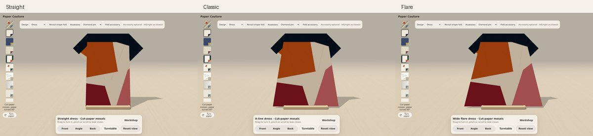
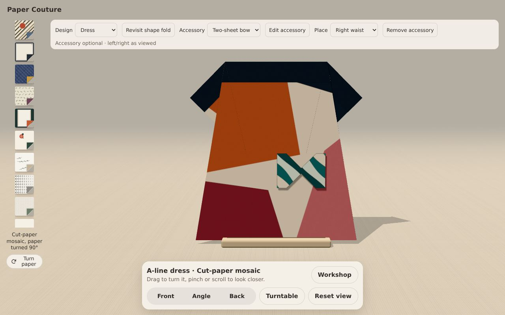
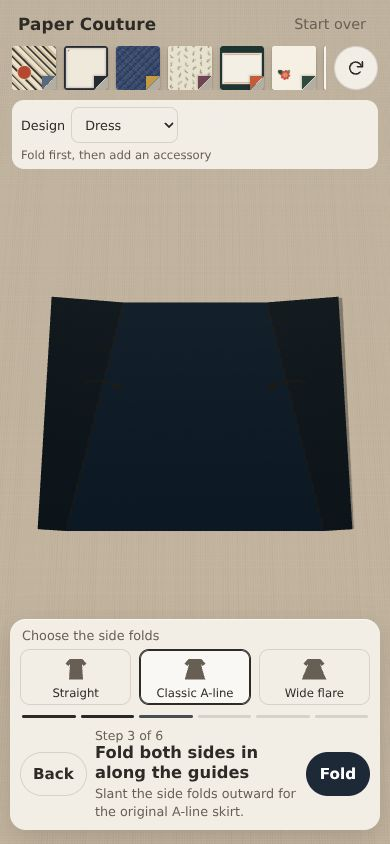

# Silhouette choices and two-sheet bow experiment

Based on the played jacket/pin snapshot `67529087cbfee41368fa9ebbc59d14ea162c2bee`,
subsequently merged into `polish/plum-petals` at `4932c6f0c0bde4e9d59a8fb3f1177fa896548184`.
Those commits have identical trees. No paper drawings or fold-engine changes.

## Try it

Fold the dress to step 3. Choose Straight, Classic A-line, or Wide flare before
folding its sides. Each uses actual crease positions. The sleeve crease follows
the chosen side fold; the original Classic geometry is retained. Small outline
icons indicate the options. Revisit shape fold returns to this decision from
later steps or Display while retaining the garment paper and its quarter-turn.
It hides the attachment until the garment is finished again. Start over keeps
the chosen silhouette and returns to the square. Switching to the jacket keeps
the dress choice for the next time the dress is selected.

After folding either garment, choose Diamond pin or Two-sheet bow and Fold
accessory. Paper and rotation remain independent of the garment. The bow uses
two small squares: a five-step wing sequence, Second wing, then the same sequence
for the other square. Both wings share the accessory's paper and turn. Attach
arranges them with their narrow tips overlapping. This is a modular paper bow
experiment, not a traditional single-sheet bow or an asserted locking joint.
The workshop makes both squares explicit; no single sheet is cloned mid-fold.

Place either accessory at neckline, left/right chest, or left/centre/right waist.
Left and right mean as viewed from the garment's front. Remove accessory leaves
the garment bare. One accessory is attached at a time. Selecting a different
accessory type and pressing Fold accessory starts that construction; the old
attachment is removed. Returning from an unfinished accessory leaves it unattached
and preserves its step for later. A partially finished second bow wing resumes
as the second wing. The jacket uses its own height when placing an accessory.

## Validation

- Node 24: npm ci, typecheck, geometry/controller/two-sided rotation checks, build.
- Geometry checks include Straight, Classic, Wide flare, jacket, pin, and bow wing.
  Material area, rigid transforms, shared edges, animation boundaries, sampled
  hinge gaps, and table clearance use the existing checks without weaker limits.
- A regression check requires the first two dress operations to be identical for
  all silhouettes, so choosing at step 3 cannot change previously completed folds.
- Browser checks and screenshots: `styling/browser-result.json` and `styling/`.
  Rerun with `npm run build -- --base /play/paper-couture/` then
  `node scripts/check-styling.cjs` with Playwright installed separately.
  The script serves the production bundle under the site's CSP. Browser evidence
  is headless Chromium/software WebGL, not a physical phone or Safari.
- The full interaction pass preceded a final layout-only correction: inactive
  accessory buttons are hidden while folding; short landscape controls scroll
  horizontally to preserve room for the paper. A separate layout-result.json
  records the final portrait/landscape check, including reaching Remove and Attach.

## Limits and next ideas

No physical paper validation or proof of continuous collision-free folding.
The bow is intentionally faceted and has no ribbon tails or separate knot band.
Its flat front is more bow-tie-like than a soft tied ribbon. Accessories are styling
placements, not fastening simulations. There is still no saved project on reload.

A paper mannequin could be an optional folded display easel with a small head and
shoulders behind the garment. Keep it separate from construction; don't invent a
body volume that these flat garments were not folded to fit. Explore only after
these controls have been played. An open-front lapel vest is a stronger next
construction contrast than another adjustment to the existing dress.

## Captured views

