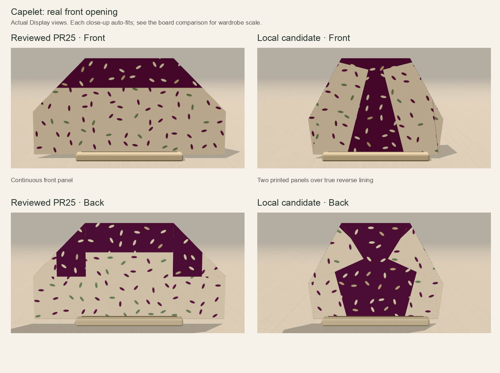
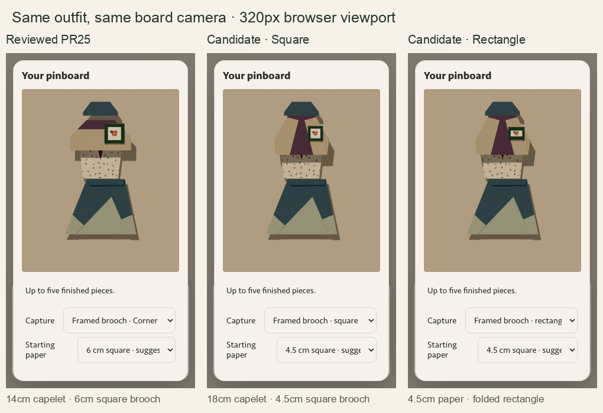
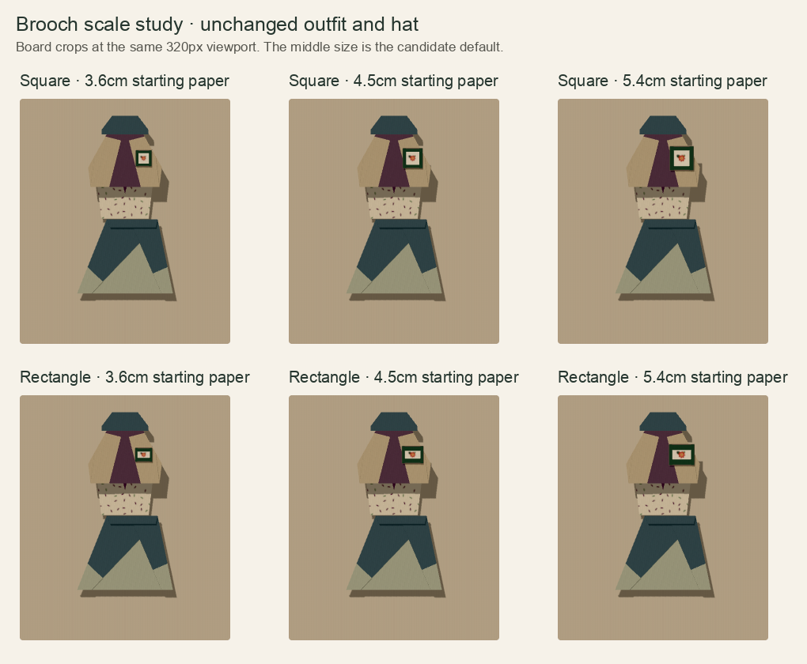

# Local capelet and brooch refinement

This is an unpublished local candidate on `codex/capelet-brooch-refinement`, based
on the exact reviewed PR25 head `21e0fdbd67b8c9c0e2ff7c6b8fb2baf7a851657f`.
PR25, Site PR38 and their existing preview were not updated. No push, PR, merge
or deployment is part of this follow-up.

## What the comparison established

The reviewed capelet's Front preset was correct: it showed a continuous printed
panel beneath the reverse collar. There was no front opening in that construction.
Changing the camera label or painting a seam would not create one.

The candidate replaces new capelet folds with two slanted gate panels over the
continuous reverse lining, then shapes the hem and shoulders from behind. Their
real free edges spread toward the hem. It is named **Open-front capelet**, remains
Experimental, and claims no through-opening or fastening. The previous collar
band is not retained: extra collar variants exceeded the established 0.044
sampled hinge-gap limit. The selected eight-operation sequence stays at 0.0385;
none of the engine limits changed.



New capelet captures suggest an 18 cm starting square instead of 14 cm. Because
the new folds narrow the square, their actual board footprint is about
1.263 × 0.9 units, versus 1.4 × 0.7 previously. The piece stays shoulder-width;
the layered test leaves 0.475 board units / 35 px of the top below it at 320 px.
The workshop camera auto-fits close-ups, so it cannot establish relative size.

The square brooch's material geometry is unchanged. Its new suggested paper size
is **4.5 cm**, down from 6 cm. **Square / Rectangle** uses the existing authored
fold-choice and Revisit controls. The rectangle comes from deeper top/bottom
creases, retaining the entire square and true reverse on all four borders. Its
border proportions are deliberately unequal; it is not a stretched square mesh.

| New capture | Board footprint | Pixels at 320 px viewport | Fraction of hat width |
| --- | --- | --- | --- |
| Reviewed 6 cm square brooch | 0.45 × 0.45 | 33.25 × 33.25 | 56.25% |
| Candidate 4.5 cm square | 0.3375 × 0.3375 | 24.94 × 24.94 | 42.19% |
| Candidate 4.5 cm rectangle | 0.36 × 0.2925 | 26.60 × 21.61 | 45.00% |

The 3.6 cm option loses detail (rectangle height 17.29 px). The 5.4 cm options
again exceed half the hat width. 4.5 cm is the proposed compromise for review,
with the existing smaller/larger capture choices still available.





## Preservation and evidence

Only capelet construction/captions, brooch construction choice and new-capture
size suggestions change. The engine, paper art/placement, board, camera, storage
schema, accessories and other garments are unchanged. The five-piece cap stays.
The old name, size and exact raw material of already saved pieces stay in their
snapshots; no migration or re-folding is applied to them.

- `npm run typecheck`, `npm test`, `npm run build` passed on Node 24.16.0.
- Capelet and both brooch shapes retain material area 4, rigid facets and endpoint
  continuity. All operations sampled at 81 fractions stay above the floor,
  within the existing hinge limit and have zero strict triangle piercings.
  Forward/back, mid-motion reversal and reset pass. Boots retain their original
  1,600-point reference/mirror checks. The obsolete closed-capelet reference is
  replaced by explicit panel/lining exposure and widening-opening checks.
- [Focused browser results](evidence/focused-browser.json): both frozen PR25
  five-piece fixtures load exactly and export byte-identical before/after PNGs;
  all Back/refold controls; intermediate folds; front/back print alignment at
  all four paper turns; default and two alternative sizes; Square → Rectangle
  Revisit with preserved paper recipe and existing captures. The old PR25 reader
  opens the new rectangle outfit with an identical PNG too.
- [Broad regression](evidence/integration-browser.json): PR24 snapshot and
  unsupported-paper protection, accessory round-trip, desktop/390/320 framing,
  full-board bounds at both tilt limits, layer order, repeated remove/Undo with
  stable GPU counts, reload, quota failure/retry, touch cancel/commit/Undo and
  exact 1800 × 2100 scene export. All existing thresholds remain in force.
- [Choice/touch check](evidence/choice-touch.json): Rectangle → Square Revisit,
  option/turn/offset reload, and actual small rectangle touch cancel/commit/Undo
  at 320 px preserve all five saved captures.
- [Square brooch regression](evidence/square-browser.json): actual folds and
  front/back renders, centred blossom increases exposed red ink, deliberately
  occluded placement hides it; revised sizes, offset capture, remove/Undo,
  reload and exact scene export.
- Actual-engine visibility maps: [capelet](evidence/capelet.svg),
  [square](evidence/brooch-square.svg), [rectangle](evidence/brooch-rectangle.svg).
  Each uses 9,216 material samples, both faces/views and all four rotations;
  reverse source coordinates mirror x once. These are normal-projection maps,
  not a substitute for the rendered camera views.

The raw screenshots, full PNG exports, runtime logs and rejected-concept screen
are preserved in the sibling workspace `output/capelet-brooch-review/`. The
committed [concept screen](evidence/concept-screen.json) is only a coarse
17-sample diagnostic; it is not the final geometry gate. Its constructors and
frozen PR25 reference are in `study/` for inspection.

## Reproduce locally

Use Node 24, `npm ci --no-audit --no-fund`, then the three checks above. Serve the
compiled candidate at 4401, frozen PR25 at 4400 and frozen PR24 at 4292. Set
`PLAYWRIGHT_MODULE` to an installed Playwright package. Do not use a personal
browser profile. These scripts create disposable contexts:

```sh
BASE_URL=http://127.0.0.1:4401 BASELINE_URL=http://127.0.0.1:4292 CAPTURE_DIR=.qa/integration node scripts/check-companion-browser.cjs
CAPTURE_DIR=.qa/focused node scripts/check-capelet-brooch-browser.cjs
CAPTURE_DIR=.qa/focused node scripts/check-brooch-choice-browser.cjs
BASE_URL=http://127.0.0.1:4401 CAPTURE_DIR=.qa/square node scripts/check-framed-brooch-browser.cjs
node --import tsx scripts/check-companion-visibility.ts .qa/visibility
```

Local play: `http://127.0.0.1:4401/?design=capelet&paper=plum-seed` or
`http://127.0.0.1:4401/?design=framed-brooch&broochShape=rectangle&paper=corner-bloom`.
A phone can review the existing immutable PR25 preview, but these refinements
need a separately approved draft/preview publication before remote phone play.

## External design brief and remaining review

[Forwardable plain-text brief](Paper-Couture-external-design-brief.txt) asks for
one outstanding garment or accessory, a small initial concept comparison, real
engine geometry, readable outfit scale and print-placement evidence. There is
no arbitrary minimum fold count. It is also saved as a plain-text Library file.
No external model was contacted.

These are Chromium/SwiftShader browser checks, not physical-phone or paper tests.
The capelet has lining behind its opening; it is not a wearable garment. The
brooch is a flat decorative piece without a pin. Sampled motion checks do not
certify every continuous collision or physical foldability. Owner review should
judge the new capelet silhouette and 4.5 cm brooch before any publication.
