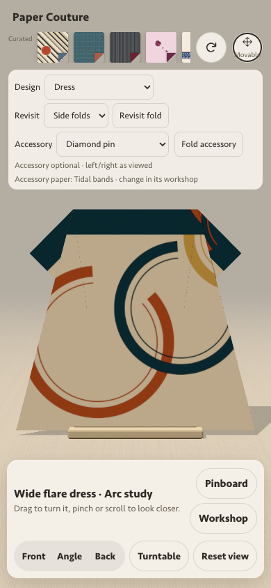
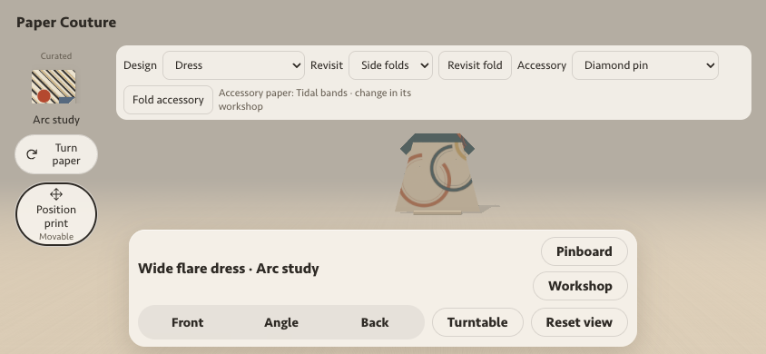

# Playtest clarity pass — draft, 2026-10-05

Print positioning now says **Fixed**, **Movable**, or **Set shifts** before opening the editor. Fixed papers still open their explanatory dialog and can still be turned. The accessory action discloses its own remembered paper before opening its workshop. Small arrow grips say **Fold this step (handle 1/2)**: their number identifies a handle, not a later timeline step.

This is a small UI pass based on the published `ce3431b54492cd01553219087fa1a257e720c0c6`. Branch `usability/print-status-20261005` starts at its exact merged successor `bbb466aeca7555a5e8f39dbe2b3af3acbc8c7846` on `experiment/integrated-studies-20261004`; the two trees match exactly. No source merge, site change or production deployment is part of this draft.

## Findings and decisions

| Priority | Playtest observation | Source and browser finding | Decision |
| --- | --- | --- | --- |
| High | Movable versus fixed becomes clear only inside Position print | Placement metadata already distinguishes free slides, approved snap shifts, and authored fixed prints. | Show the capability on the existing button, including the narrow phone row; expose it as the accessible description. |
| High clarity | Numbered small flap suggested a subsequent flap 2 | The dress hem operation folds both points together. In the published browser, activating either handle completes step 5 only; the final turn remains step 6. Pin has a separate five-operation corner sequence whose last corner completes the pin. No skipped step was reproduced. | Name the current fold step explicitly; retain each pointer target and existing tap/drag/keyboard behavior. |
| High clarity | Opening Bow quietly switches to Tidal bands | Garment and accessory keep independent papers. The accessory starts in Tidal bands; later Bow/pin edits use the last accessory paper. Returning restores the garment paper and offset. | Disclose the actual remembered paper before opening; retain defaults and memory. |
| Medium | Consider busy/disabled Fold during animation | Repeated Fold intentionally finishes the active operation without starting another. Back can reverse active motion. A lock would remove these reviewed interactions. | Keep the controller and button behavior. Seek a repeatable confusion case before adding animation feedback. |
| Low | Save PNG confirmation wording | A real browser download produces the requested 1600×1200 PNG. Completion on disk and the browser's download shelf remain browser-controlled. | Retain Save PNG; avoid promising a filesystem save or browser notification. |

The owner's Library PNG was materialized through the supported consumer-local transfer helper, then inspected as pixels. It shows the shifted Arc study dress with a diamond pin on the linen pinboard. It supports the successful rendered export observation; it does not establish physical-paper folding or continuous collision clearance. The original remains in Library and the private local reference directory; the images below are fresh candidate captures.

## Verification

- Node 24: `npm ci`, `npm run typecheck`, `npm test`, `npm run build` all pass.
- Exact before/after comparison: **46 front/back paper rasters, nine garment operation sequences and six accessory constructions/transforms match the published source**. Paper drawing, fold engine, camera, renderer, positioning and pinboard source files have no changes.
- Built preview, actual controls: fixed/slide/snap capabilities, offsets and turn through reload, Fold/Back/Start over, rapid second press, both 44px hem handles via keyboard, mouse rollback/full drag, portrait emulated-touch tap, both Bow wings, accessory edit/return/switch, independent garment/accessory offsets, existing storage sentinel, and actual PNG export all pass. No page exceptions.
- Screenshots inspected at **1100×800**, **390×844**, **844×390**. No page overflow, toolbar/dock overlap or clipped capability/paper cue. Landscape toolbar wraps to keep the separate-paper cue visible; its smaller available model area is visible in the evidence.
- These are headless Chromium/software WebGL and emulated-touch checks, not a real phone/Safari or physical origami test.

Run the focused check against a built preview and the exact published baseline:

```sh
BASE_URL=http://127.0.0.1:4187 \
DEV_URL=http://127.0.0.1:5187 \
BASELINE_URL=http://127.0.0.1:5186 \
PLAYWRIGHT_MODULE=/path/to/playwright \
CHROMIUM_EXECUTABLE_PATH=/path/to/chromium \
node scripts/check-usability-browser.cjs
```

The existing positioning CI also runs this focused check against a built preview and uploads `playtest-clarity-rendered-checks`.

## Review evidence

[Machine-readable results](evidence/browser-results.json), [exact baseline hashes and operation signatures](evidence/baseline-parity.json), [published-baseline reproduction](evidence/baseline-reproduction.json), [fresh 1600×1200 PNG](evidence/pinboard-export.png).

Before: [published fixed-paper desktop](evidence/before-fixed-desktop.png). After: [desktop](evidence/display-1100.png), [portrait](evidence/display-390.png), [landscape](evidence/display-844.png), [fixed phone button](evidence/fixed-390.png), [snap phone button](evidence/snap-390.png), [shared hem handles](evidence/fold-handles-desktop.png).




